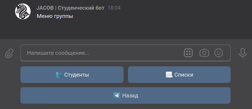

# Настройка группы

Менеджмент группы — меню, в котором вы можете настроить вашу активную группу.

## Студенты

Вам доступна полная настройка каждого студента:

- Смена имени/фамилии
- Обновление контактных данных
- Изменение формы обучения
- Назначение/разжалование администраторов
- Удаление студентов

## Списки студентов

Списки — это способ быстро объединить студентов для удобной работы со всеми сразу. Сейчас реализована интеграция Списков с Призывом.

Вы можете быстро выбрать группу студентов для Призыва.

