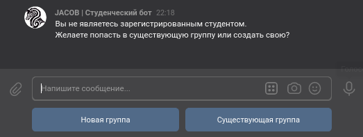

# Создание группы

Если пользователь, не зарегистрированный ранее как студент запустит бота, ему будет предложено создать новую группу или присоединиться к уже существующей группе *(в разработке)*

## Новая группа

Вам нужно будет лишь

1. Выбрать университет (или создать свой)

    !!! note "Nota Bene"
        Пожалуйста, при создании университета указывайте его полное название (например **Владимирский государственный университет**, но не **ВлГУ**)

2. Указать номер группы (например **ИСТ-120**)
3. Написать название специальности (например **Информационные системы и технологии**)
4. Выбрать приватность группы
5. Добро пожаловать. Вы автоматически станете администратором новой группы

## Приватность группы

Студенческие группы могут быть приватными или публичными. К публичным группам могут присоединяться новые студенты, к приватным — нет.

## Присоединение к существующей группе

Вы можете не создавать новую группу, а присоединиться к уже существующей публичной группе.

Выберите меню "Существующая группа", затем университет и публичную группу в нём.

Все администраторы этой группы получат уведомление о новом запросе на вступление.

Когда хоть один администратор примет ваш запрос, вы автоматически станете студентом выбранной вами группы.
