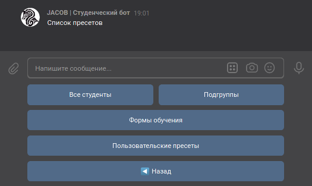
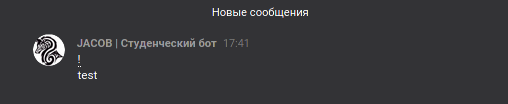

# Призыв

## Описание

:material-account-cog: Нужен доступ администратора

Призыв — это функция, которая позволяет отправить в подключенную беседу сообщение с упоминанием выбранных студентов

## Интерфейс

В главном меню (вызывается по команде `Начать`) нажмите на кнопку {:trumpet: Призыв}, чтобы открыть меню Призыва.

Для работы функции вам нужен хотя бы один чат. Если у группы нет [зарегистрированных](settings.md) чатов, Призыв не запустится:

Вам предложат ввести текст, который должен сопровождать Призыв и прикрепить вложения *(сейчас поддерживаются фотографии и голосовые сообщения)*
Вы можете также пропустить ввод сообщения и отправить только упоминания, нажав на кнопку {:fast_forward: Пропустить}

Далее откроется меню Призыва. Здесь можно:
- выбрать студентов для Призыва (все студенты находятся в подменю по первым буквам их фамилий),
- использовать пресеты
    - выбрать всех студентов для Призыва
    - выбрать по подгруппам
    - выбрать по формам обучения
    - [кастомные списки](../configure/group.md)
- сохранить Призыв
- отменить Призыв
- изменить текст Призыва

Когда студент добавлен в список Призыва, возле его имени появляется галочка (:white_check_mark:)

Пресеты позволяют быстро выбрать для призыва целую пачку студентов

В меню подтверждения призыва вы можете изменить настройки (чат для отправки, использование имен).
Параметр "Использование имен" влияет на способ генерации призыва. С именами из базы данных в качестве подсказок или с восклицательными знаками (!)

После нажатия на кнопку {:white_check_mark: Подтвердить} в выбранный чат отправится сохранённое сообщение:

