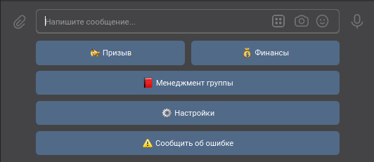
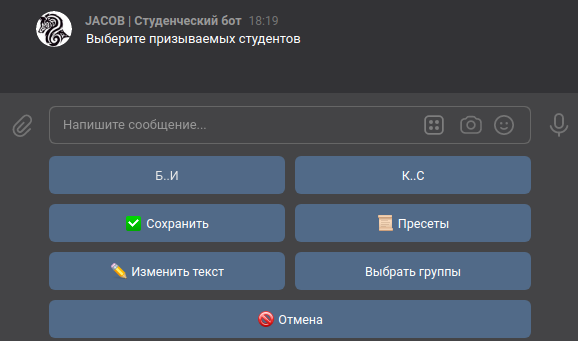
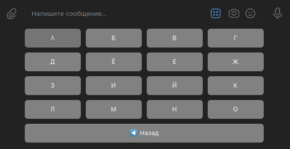
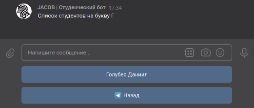
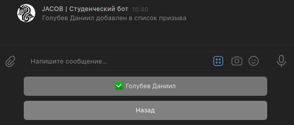
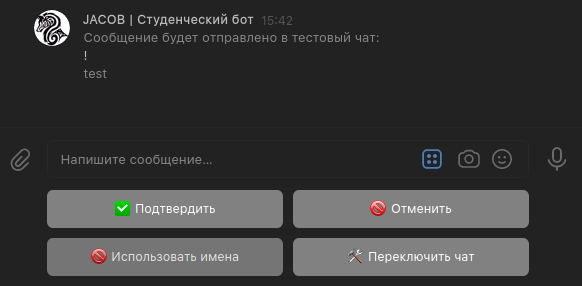
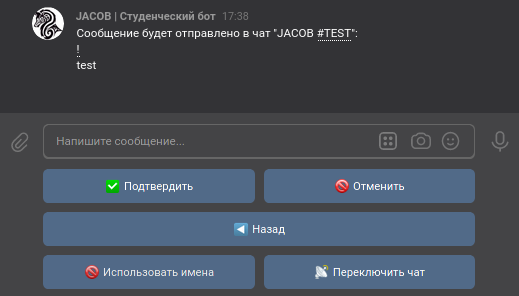

# Призыв

## Описание

:material-account-cog: Нужен доступ администратора

Призыв - это функция, которая позволяет отправить в подключенную беседу сообщение с упоминанием выбранных студентов

## Интерфейс

{: align=center}

В главном меню (вызывается по команде `Начать`) нажмите на кнопку {:trumpet: Призыв}, чтобы открыть меню Призыва.

{: align=center}
  
Вам предложать ввести текст, который должен сопровождать Призыв и прикрепить вложения *(сейчас поддерживаются фотографии, документы, граффити и голосовые сообщения)*  
Вы можете также пропустить ввод сообщения и отправить только упоминания, нажав на кнопку {:fast_forward: Пропустить}

{: align=center}

Далее откроется меню Призыва. Здесь можно выбрать студентов для призыва (все студенты находятся в подменю по первым буквам их фамилий), выбрать всех студентов для Призыва, сохранить или отменить Призыв  
Выберите студентов для Призыва и нажмите кнопку {:white_check_mark: Сохранить}, чтобы настроить и подтвердить Призыв

{: align=center}

Когда количество уникальных первых букв фамилий превышает 15 вместо списка букв отображается список из двух диапазонов букв, при нажатии на который открывается список из букв в этом диапазоне. В остальном такой вариант раскладки ничем не отличается от стандартного. 

{: align=center}

{: align=center}

{: align=center}

Когда студент добавлен в список Призыва, возле его имени появляется галочка (:white_check_mark:) 

{: align=center}

В меню подтверждения призыва вы можете изменить настройки (чат для отправки, использование имен).  
Параметр "Использование имен" влияет на способ генерации призыва. С именами из ВК в качестве подсказок или с восклицательными знаками (!)

{: align=center}

После нажатия на кнопку {:white_check_mark: Подтвердить} в выбранный чат отправится указанное сообщение
