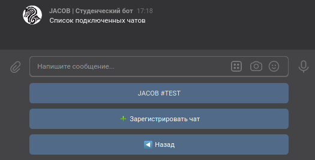

# Настройки

## Настройка чатов
:material-account-cog: Нужен доступ администратора

В этом меню вы можете подключить необходимые для работы бота чаты, причем они будут сохранены именно в вашей группе и не будут доступны никому другому

{: align=center}

Главное меню Настройки Чатов отображает список подключенных к вашей группе чатов. Так же отображается кнопка {Зарегистрировать чат}

### Регистрация чатов

Здесь можно прикрепить чат к вашей группе. Для этого бот пришлёт кодовую фразу. Её нужно отправить в чат, который вы хотите прикрепить.  
Чтобы бот получил событие о сообщении с кодовой фразой, он должен иметь права администратора или полный доступ к переписке.

### Меню чата

{: align=center}

#### Отключение чата

Нажав на эту кнопку, вы отвяжете чат от вашей группы

#### Индексация чата

Это функция сканирования чата, которая показывает различия между участниками чата и студентами в базе данных.  
Студентов, которых нет в чате, но есть в БД, можно удалить из БД, а студентов, которые есть в чате, но нет в БД, можно туда добавить. 

